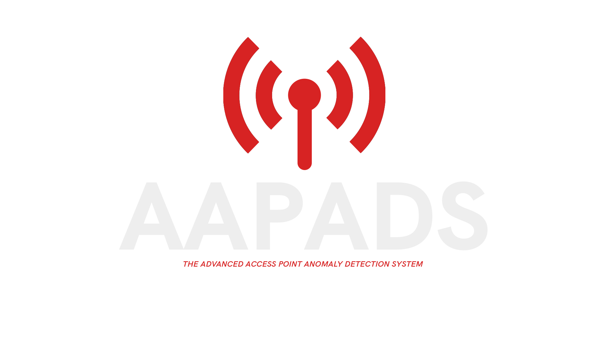
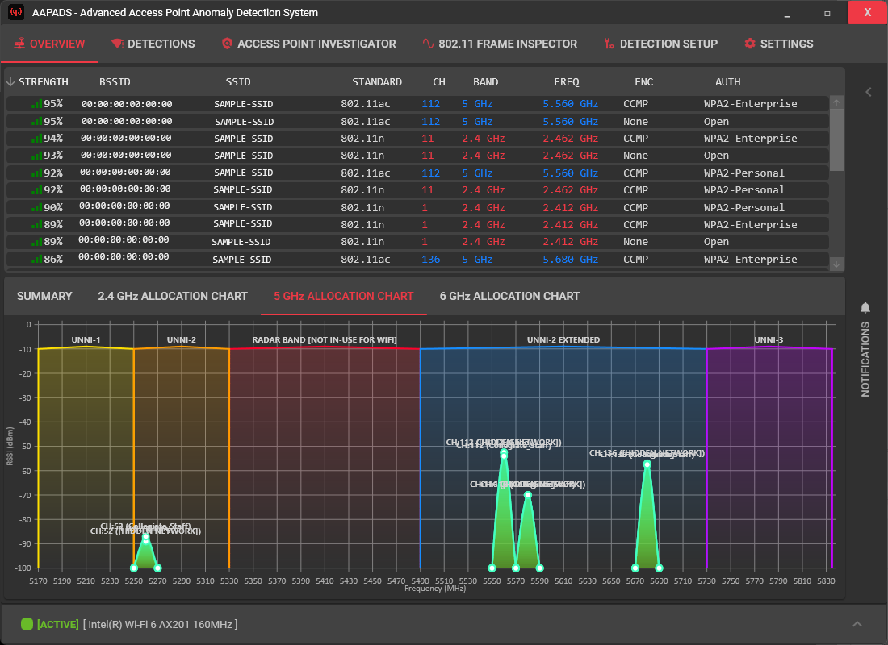
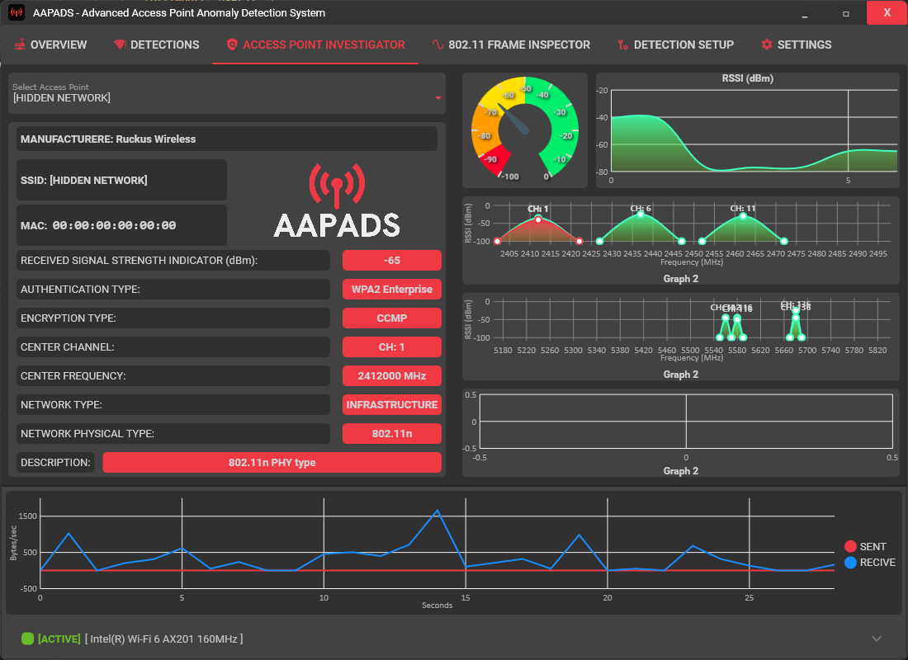
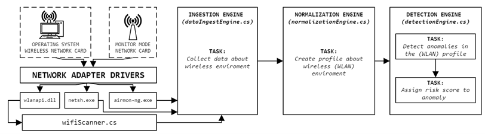

  

  <strong>🛡️ Advanced Access Point Anomaly Detection System 🛡️</strong>

## 📌 Introduction
The **Advanced Access Point Anomaly Detection System (AAPADS)** proactively mitigates the increased risk of data interception and provides early detection of possible wireless attacks.

## Technical Overview 🖥️
### Platform & Development Environment:

  
  

  <i>Note: The SSID and MAC addresses shown in the screenshots are samples.</i>

* Primary Language: C#
* Platform: x64 (64-bit) Windows operating system.
* User Interface: Developed using Microsoft's WPF (Windows Presentation Foundation) to ensure an interactive front-end experience.

### 📐 Architecture

  <italic>Not Final Version</italic>

### 1️⃣ Data Ingest Engine 
* **Function**: Collects data about the wireless environment in which AAPADS operates.
* **Data Type**: Electromagnetic wave transmissions in the 2.4GHz and 5GHz range (+6GHz if your WLAN adapter supports Wi-Fi 6).
* **Operation**: Continuously passes data to the next stage for processing.

### 2️⃣ Normalization Engine 
* **Function**: Defines the "normal" state of the wireless environment.
* **Process**: Sets thresholds for certain data types collected from the Data Ingest Engine.
* **Outcome**: Creates a profile of the wireless environment, used by the Detection Engine.

### 3️⃣ Detection Engine 
* **Function**: Analyzes the wireless environment profile.
* **Operation**: Identifies data surpassing threshold values, assigning a risk score to detected anomalies.
* **Scoring System**: Anomalies are graded with a score value (max 100), and categorized as:
    * 🟢 **LOW** (0-30)
    * 🟡 **MEDIUM** (31-60)
    * 🟠 **HIGH** (61-79)
    * 🔴 **CRITICAL** (80-100)

Upon detection of an anomaly, the system flags it as a cyber incident. Users are notified and can directly take action through the application.

## 🚀 Usage

1. Launch AAPADS.
2. Allow the system to collect and process wireless environment data.
3. Monitor the notifications and take action as necessary.

## ⚙️ Setup & Installation
Will be released with the first official program release 

## 📜 License
TBA 

  

